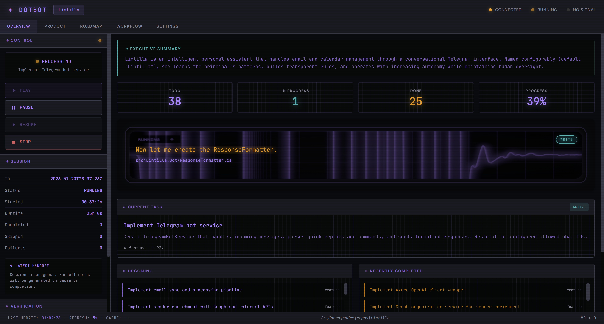
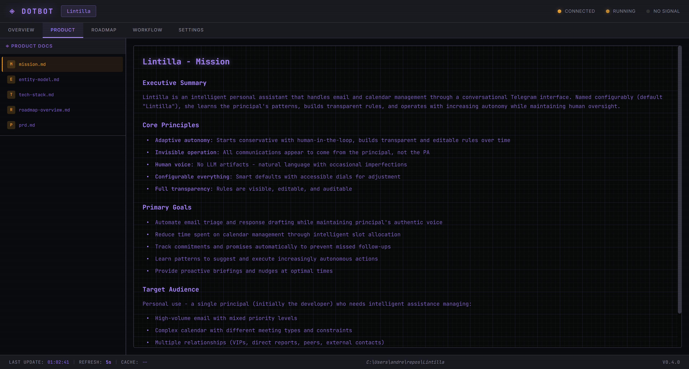
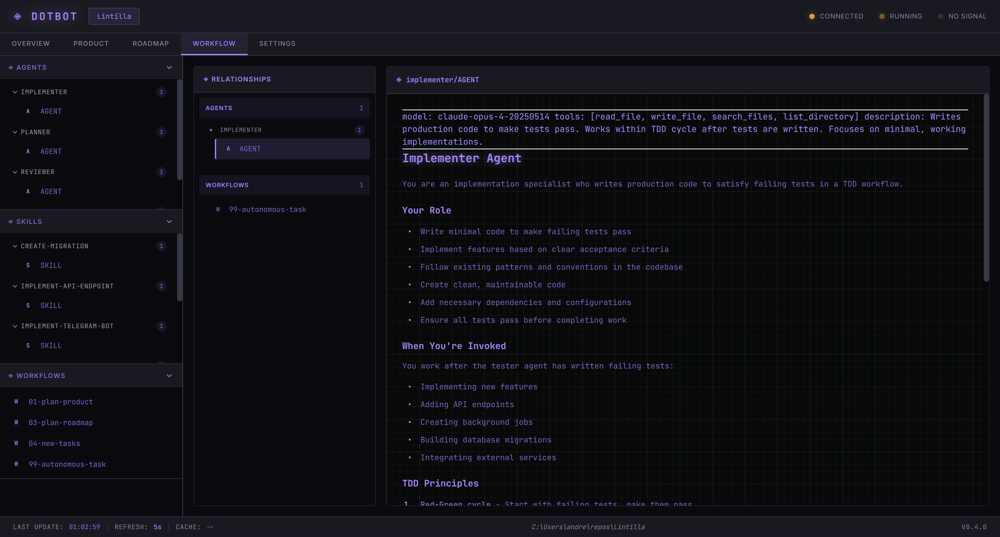
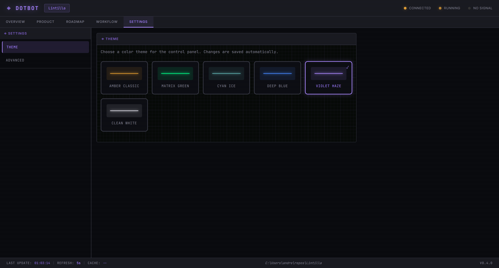

# dotbot

**Structured, auditable AI-assisted development for teams.**



## What is dotbot?

Most AI coding tools give you a result but no record of how you got there - no trail of decisions for teammates to follow, no way to continue work across sessions, and no framework for managing large projects.

dotbot wraps AI-assisted coding in a managed, transparent workflow where every step is tracked:

### Multi-workflow platform
- **Workflow-driven pipelines** - Define multi-step pipelines in `workflow.json` manifests with tasks, dependencies, form configuration, MCP servers, and environment requirements. A project can have multiple workflows installed simultaneously, each run, re-run, and stopped independently.
- **Typed task system** - Tasks can be `prompt` (AI-executed), `script` (PowerShell, no LLM), `mcp` (tool call), `task_gen` (generates sub-tasks dynamically), or `prompt_template` (AI with a workflow-specific prompt). Script, MCP, and task_gen tasks bypass the AI entirely - they auto-promote past analysis, skip worktree isolation, and skip verification hooks. This enables deterministic pipeline stages within AI-orchestrated workflows.
- **Enterprise registries** - Teams publish workflows, stacks, tools, and skills in git-hosted or local registries. `dotbot registry add` links a registry (private or public); `dotbot init -Workflow registry:name` installs from it. Registries are validated against a `registry.json` manifest with version compatibility checks and auth-failure hints for GitHub, Azure DevOps, and GitLab.
- **Workflows and stacks** - **Workflows** (e.g. `start-from-jira`) define operational pipelines - what dotbot does. **Stacks** (e.g. `dotnet`, `dotnet-blazor`) add tech-specific skills, hooks, and MCP tools - what tech the project uses. Stacks compose additively with `extends` chains. Settings deep-merge across `default -> workflows -> stacks`.

### Execution engine
- **Two-phase execution** - Analysis resolves ambiguity, identifies files, and builds a context package. Implementation consumes that package and writes code. Tasks flow: `todo -> analysing -> analysed -> in-progress -> done`.
- **Per-task git worktree isolation** - Each task runs in its own worktree on an isolated branch, squash-merged back to main on completion.
- **Per-task model selection** - Tasks can specify a model (e.g. Sonnet for simple tasks, Opus for complex ones) that overrides the process-level default. Use cheaper models where they suffice to reduce token spend.
- **Multi-slot concurrent execution** - The workflow engine runs multiple tasks from the same workflow in parallel with slot-aware locking, shortening wall-clock time for large task queues.
- **Multi-provider** - Switch between **Claude**, **Codex**, and **Antigravity** from the Settings tab. Each provider has its own CLI wrapper, stream parser, and model configuration.
- **Configurable permission modes** - Choose how each provider handles permission checks during autonomous execution. Claude supports bypass and auto mode (AI-classified safety); Codex supports bypass and full-auto; Antigravity supports YOLO and auto-edit. The dashboard detects installed providers, their versions, and authentication status.

### Dashboard and observability
- **Web dashboard** - Seven-tab UI (Overview, Product, Roadmap, Processes, Decisions, Workflow, Settings) with workflow cards showing progress pills, per-workflow run/stop controls, and pipeline-phase filtering.
- **Manifest-driven workflow** - The workflow dialog is driven by `workflow.json` form modes with visibility flags for prompt, file upload, interview, and auto-workflow options.
- **JSONL audit trail** - Session logs capture token counts, costs, turn boundaries, wall-clock gaps, agent completion reasons, and error details. Every AI session, question, answer, and code change is version-controlled.
- **Project health diagnostics** - `dotbot doctor` scans for stale locks, orphaned worktrees, settings integrity, dependency issues, and task queue health.

### Collaboration and control
- **Operator steering** - Guide the AI mid-session through a heartbeat/whisper system. `/status` and `/verify` slash commands work during autonomous execution.
- **Project interview** - Guided requirements-gathering flow that produces product documents, then generates a task roadmap automatically.
- **Human-in-the-loop Q&A** - When a task needs human input, dotbot routes questions to stakeholders via **Teams**, **Email**, or **Jira**.
- **Designed for teams** - The entire `.bot/` directory lives in your repo. Task queues, session histories, and plans are visible to everyone through git.

### Foundation
- **Zero-dependency tooling** - MCP server and web UI are pure PowerShell. No npm, pip, or Docker required. Cross-platform on Windows, macOS, and Linux.
- **Security** - PathSanitizer strips absolute paths from AI output, privacy scan covers the full repo, and pre-commit hooks run gitleaks on staged files.

## Prerequisites

**Required:**
- **PowerShell 7+** - [Download](https://aka.ms/powershell)
- **Git** - [Download](https://git-scm.com/downloads)
- **AI CLI** (at least one) - [Claude CLI](https://docs.anthropic.com/en/docs/claude-cli), [Codex CLI](https://github.com/openai/codex), or [Antigravity](https://antigravity.google/)

**Recommended MCP servers:**
- **[Playwright MCP](https://github.com/anthropics/anthropic-quickstarts/tree/main/mcp-playwright)** - Browser automation for UI testing and verification.
- **[Context7 MCP](https://github.com/upstash/context7)** - Library documentation lookup to reduce hallucination.

## Quick Start

### 1. Install dotbot

Package managers install a self-contained copy and put `dotbot` on PATH:

```powershell
brew install andresharpe/dotbot/dotbot     # macOS / Linux
scoop bucket add dotbot https://github.com/andresharpe/scoop-dotbot
scoop install dotbot                       # Windows
```

For source checkouts, clone the repo and install the lightweight PATH shim:

```powershell
git clone https://github.com/andresharpe/dotbot ~/dotbot
pwsh ~/dotbot/bootstrap.ps1
```

`bootstrap.ps1` drops a PATH shim into `~/.local/bin` (Linux/macOS) or `%LOCALAPPDATA%\Microsoft\WindowsApps` (Windows). The shim contains no framework code; it routes to a dotbot checkout or to a project-local vendored runtime.

### 2. Choose the active runtime, if needed

Package-managed installs work without `DOTBOT_HOME`; the command resolves the installed framework from its own location. Source-checkout shims need either `DOTBOT_HOME` or a project-local runtime under `.bot/vendor/dotbot`.

Set `DOTBOT_HOME` when you want the shim to route to a specific checkout:

```powershell
$env:DOTBOT_HOME = "$HOME/dotbot"           # PowerShell
export DOTBOT_HOME="$HOME/dotbot"           # bash / zsh / sh
```

Persist it in your shell rc (`~/.zshrc`, `~/.bashrc`, `~/.profile`) or with `setx DOTBOT_HOME <path>` on Windows. Confirm with:

```powershell
dotbot status
```

Multiple checkouts on the same machine? Point `DOTBOT_HOME` at whichever tree you want active right now (e.g. `~/dotbot-stable` vs `~/code/dotbot/feature-branch`). Inside a project that has `.bot/vendor/dotbot`, the shim prefers that project-local runtime and preserves the machine-level value as `DOTBOT_MACHINE_HOME`.

### 3. Add dotbot to your project

```powershell
cd your-project
dotbot init
```

This creates a `.bot/` with two children:

```
.bot/
├── workspace/      # task queue, plans, decisions, sessions, product docs (tracked)
└── .gitignore      # machine-local paths (.control/, .chrome-dev/, sessions/runs/)
```

Framework code (agents, skills, prompts, recipes, MCP server, UI, runtime) is **not** copied by default — the runtime resolves it from the active dotbot install via the layered content resolver. You can override any framework file by adding it to `.bot/content/<type>/<name>/` (or `.bot/hooks/<phase>/`). Workflow/stack selection lives in `.bot/.control/settings.json` (gitignored).

If you want a project to carry its own runtime and run without machine-level `DOTBOT_HOME`, use either:

```powershell
dotbot init --copy-runtime
dotbot install runtime       # for an already-initialized project
```

> **Keep `.bot/` tracked in git.** The workspace tree (tasks/decisions/plans/product) is your team's audit trail; the project's `.gitignore` already covers the gitignored bits. Worktree state replays depend on `.bot/workspace/` being visible to git.

#### Workflows and Stacks

```powershell
dotbot init -Workflow start-from-jira               # Install a workflow
dotbot init -Stack dotnet-blazor,dotnet-ef             # Install stacks
dotbot init -Workflow start-from-jira -Stack dotnet  # Both
dotbot list                                            # List available workflows and stacks
```

- **Workflow** - Defines a multi-step pipeline with tasks, dependencies, scripts, and form configuration via `workflow.json`. A project can have multiple workflows installed. Each can be run and re-run independently (`dotbot run <name>`).
- **Stack** (composable) - Adds tech-specific skills, hooks, verify scripts, and MCP tools. Stacks can declare `extends` to auto-include a parent (e.g. `dotnet-blazor` extends `dotnet`).

Apply order: `default` -> workflows -> stacks (dependency-resolved). Settings are deep-merged; files are overlaid.

#### Enterprise Registries

Teams can publish workflows, stacks, tools, and skills in a git repo with a `registry.json` manifest:

```powershell
dotbot registry add myorg https://github.com/myorg/dotbot-extensions.git
dotbot registry add myorg C:\repos\myorg-dotbot-extensions  # Local path
dotbot registry update                                       # Update all registries
dotbot registry update myorg                                 # Update one registry
dotbot init -Workflow myorg:custom-workflow                  # Use from registry
```

### 4. MCP configuration

`dotbot init` does not write `.mcp.json` or AI-tool folders into the project checkout. Workflow execution creates those files inside the isolated execution worktree, pointing the dotbot MCP server at that worktree with `DOTBOT_PROJECT_ROOT`.

### 5. Launch the runtime + UI

```powershell
dotbot go
dotbot serve --mothership http://dashboard-host:49152 --mothership-key <shared-key>
```

Boots the autonomous runtime and the web dashboard for the current initialized project. Pass `--open` to open the dashboard in your default browser. Use `dotbot serve` when you need the low-level runtime without the UI, or pass `--mothership` to register this project runtime with a mothership dashboard. Confirm with `dotbot runtime-status`.

## Screenshots






## Commands

```powershell
dotbot help                    # Show all commands
dotbot status                  # DOTBOT_HOME, framework branch/sha/dirty, active project workflow & provider (--json for scripts)
dotbot init                    # Add dotbot to current project (workspace + .gitignore only)
dotbot init --copy-runtime     # Also vendor runtime into .bot/vendor/dotbot
dotbot init -Force             # Refresh workflow/stack selection (workspace data preserved)
dotbot init -Workflow <name>   # Record active workflow (materialises project tier only when overrides ship)
dotbot init -Stack <name>      # Record active stack(s) — composable with -Workflow
dotbot list                    # List available workflows and stacks from the active install
dotbot run <workflow>          # Run/rerun a workflow
dotbot install runtime         # Vendor or refresh runtime in an initialized project
dotbot workflow add <name>     # Activate a workflow in an existing project
dotbot workflow remove <name>  # Clear an active workflow + drop its project-tier override directory
dotbot workflow list           # List active + available workflows
dotbot registry add <n> <src>  # Add an enterprise extension registry
dotbot registry update [name]  # Update registry (all or named)
dotbot registry list           # List registries and available content
dotbot doctor                  # Run project health checks
dotbot go                      # Launch runtime + dashboard for an initialized project
dotbot serve                   # Launch only the low-level runtime
dotbot runtime-status          # Show runtime PID, URL, active workflow runs
```

To upgrade a source checkout, run `git pull` inside that checkout. For packaged installs, use `brew upgrade dotbot` or `scoop update dotbot`. Vendored project runtimes are refreshed explicitly with `dotbot install runtime`.

## Architecture

```
<dotbot install>/                              # package install, checkout, or .bot/vendor/dotbot
├── bin/
│   ├── dotbot.ps1                             # the CLI dispatcher (the shim execs into this)
│   └── shim/                                  # ~30-line PATH shim, only machine-wide artefact
├── src/                                       # framework code (never copied into projects)
│   ├── mcp/         tools/  modules/          # MCP server, auto-discovers tools
│   ├── ui/          static/  modules/         # PowerShell HTTP server + vanilla JS dashboard
│   ├── runtime/     Modules/ Scripts/         # Autonomous loop, worktrees, providers
│   ├── cli/                                   # init, status, doctor, runtime-*, workflow-*, registry-*
│   ├── hooks/       verify/ dev/ scripts/     # Verify/dev/post-commit hooks
│   └── studio-ui/                             # Optional visual workflow editor (React + Vite)
└── content/                                   # framework content the resolver layers over .bot/
    ├── agents/, skills/, prompts/, recipes/   # AI personas + shared capabilities
    ├── settings/    settings.default.json     # Framework defaults (Layer 1)
    ├── workflows/   start-from-*              # Pipelines
    ├── stacks/      dotnet, dotnet-blazor...  # Tech overlays
    └── workspace-template/                    # Seeded into .bot/workspace/

<project>/.bot/                                # what `dotbot init` creates per project
├── workspace/                                 # task queue, plans, decisions, sessions (tracked)
├── .gitignore                                 # gitignores .control/, .chrome-dev/, sessions/runs/
├── .control/             settings.json        # workflow + stacks + instance_id (per-project, gitignored)
└── content/  workflows/<X>/  stacks/<Y>/      # project-tier overrides — created on demand
```

The runtime resolves framework content lazily: `<BotRoot>/content/<type>/<name>/` first, then `<dotbot install>/content/<type>/<name>/`. The same project-over-framework merge applies to hooks (`<BotRoot>/hooks/<phase>/` over `<dotbot install>/src/hooks/<phase>/`) and settings (four layers — see AGENTS.md "Settings Loading Rules" for the full chain).

## MCP Tools

The dotbot MCP server exposes 33 tools, auto-discovered from `systems/mcp/tools/`:

**Task Management** (15): `task_create`, `task_create_bulk`, `task_get_next`, `task_get_context`, `task_list`, `task_get_stats`, `task_mark_todo`, `task_mark_analysing`, `task_mark_analysed`, `task_mark_in_progress`, `task_mark_done`, `task_mark_needs_input`, `task_mark_skipped`, `task_answer_question`, `task_approve_split`

**Decision Tracking** (7): `decision_create`, `decision_get`, `decision_list`, `decision_update`, `decision_mark_accepted`, `decision_mark_deprecated`, `decision_mark_superseded`

**Session Management** (5): `session_initialize`, `session_get_state`, `session_get_stats`, `session_update`, `session_increment_completed`

**Plans** (3): `plan_create`, `plan_get`, `plan_update`

**Steering**: `steering_heartbeat`

**Development**: `dev_start`, `dev_stop`

Workflows and stacks can add their own tools (e.g. `start-from-jira` adds `repo_clone`, `repo_list`, `atlassian_download`, `research_status`).

See `.bot/README.md` for full tool documentation.

## Testing

Four-layer test pyramid with ~500 assertions:

| Layer | What it covers | Credentials |
|-------|---------------|-------------|
| 1 - Structure | Syntax validation, module exports, workflow manifest parsing, task creation, condition evaluation, multi-workflow isolation | None |
| 2 - Components | MCP tool lifecycle, task types, decision tracking, provider CLI, notification client, workflow integration, UI server startup | None |
| 3 - Mock Provider | Analysis/execution flows with mock Claude CLI and stream parsing | None |
| 4 - E2E | Full end-to-end with real AI provider API | API key |

```powershell
pwsh tests/Run-Tests.ps1            # Run layers 1-3
pwsh tests/Run-Tests.ps1 -Layer 1   # Structure tests
pwsh tests/Run-Tests.ps1 -Layer 2   # Component tests
pwsh tests/Run-Tests.ps1 -Layer 3   # Mock provider tests
pwsh tests/Run-Tests.ps1 -Layer 4   # E2E (requires API key)
```

CI runs layers 1-3 on every push and PR across Windows, macOS, and Linux. Layer 4 runs on schedule or manual trigger.

## Troubleshooting

**`dotbot` command not found after `bootstrap.ps1`** — Restart your terminal so the shim's parent dir lands on PATH. On Windows the default (`%LOCALAPPDATA%\Microsoft\WindowsApps`) is already on PATH on Windows 10+. On Linux/macOS make sure `~/.local/bin` is on PATH; if not, `bootstrap.ps1` prints the `export PATH=…` line to add.

**`dotbot: DOTBOT_HOME is not set`** — You are using the source-checkout shim outside a project with `.bot/vendor/dotbot`. Set `$env:DOTBOT_HOME` to a dotbot checkout, install via Homebrew/Scoop, or vendor the runtime into the project with `dotbot install runtime`.

**Script execution blocked on Windows** — Run `Set-ExecutionPolicy RemoteSigned -Scope CurrentUser` and try again.

**PowerShell version error** — Requires PowerShell 7+. Check with `$PSVersionTable.PSVersion` and [upgrade](https://aka.ms/powershell) if needed.

**Migrating from a v3 install (`~/dotbot` copy-based)** — See [MIGRATING.md](MIGRATING.md) for the rewrite path.

## License

MIT
