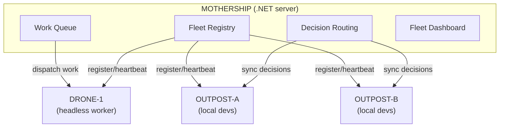
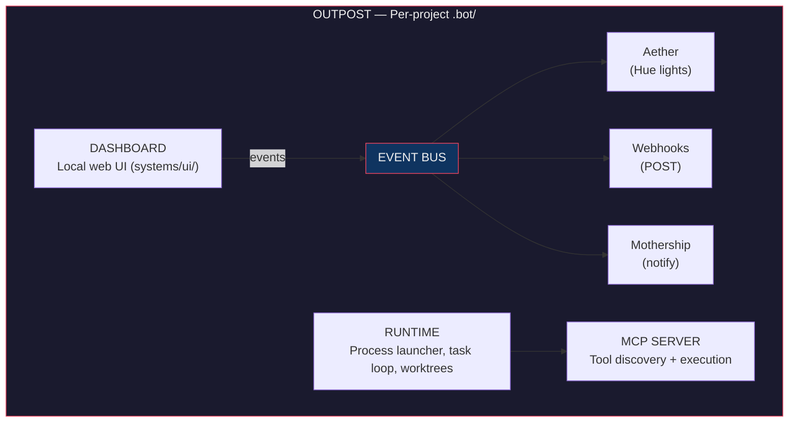
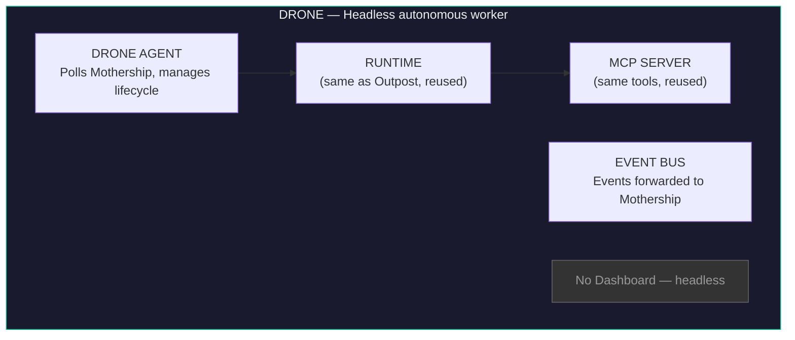
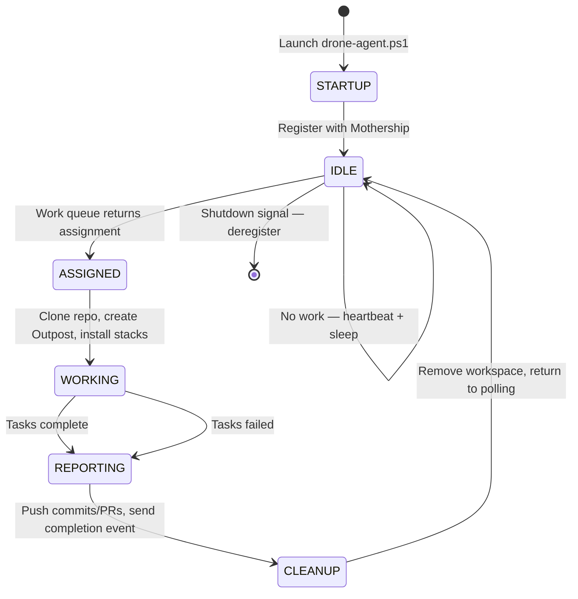
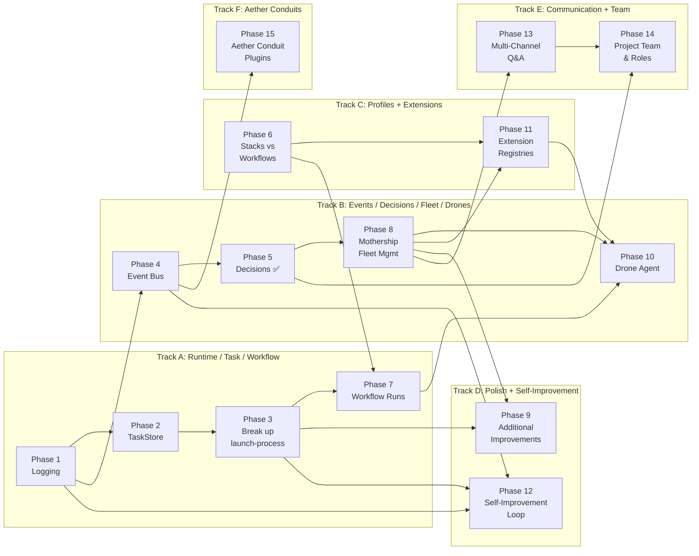

# Dotbot v3 Major Refactor Plan

## Context

Dotbot is an AI-powered software development and human orchestrator. It manages the lifecycle of business change: requirements, solutioning, planning, analysis, execution, verification, and delivery. It coordinates LLM-driven agents working in code repositories, manages their processes, tools, and prompts, and provides visibility into what they're doing. It is not an API gateway, a knowledge platform, or an infrastructure orchestration layer. It integrates well with tools that serve those purposes, but it does not try to replace them.

Dotbot v3 has grown organically and now suffers from architectural tensions: profiles conflate stacks and workflows, task/process management is brittle and monolithic, workflows are locked at init time, there's no decision tracking, logging is ad-hoc, the event/feedback system is tightly coupled, and there's no support for remote headless AI agents. This plan addresses all of these while establishing a clean component architecture with Outposts (local dev workspaces), Drones (headless autonomous workers), and a Mothership (central fleet management and work dispatch).

---

## Component Architecture

### Overview

Dotbot is composed of nine distinct architectural components. Each has a clear identity and responsibility boundary.

#### Fleet Topology

#### Outpost Internals

#### Drone Internals

### 1. Outpost (`.bot/`)

The **Outpost** is the per-project workspace directory. It's where dotbot lives in each repository — the local installation of all dotbot capabilities.

**Contains:**
- `systems/` — runtime, MCP server, UI server
- `prompts/` — agents, skills, workflows
- `workspace/` — tasks, plans, decisions, sessions, workflow runs, product docs
- `defaults/` — settings
- `.control/` — runtime state, logs, processes (gitignored)
- `hooks/` — verification, dev lifecycle, automation scripts

**Key property:** Each outpost is self-contained. You can have multiple repos each with their own outpost, all managed independently or connected to a mothership.

**Architectural name for docs:** "Outpost" — evokes a self-sufficient station that can operate autonomously but reports to a mothership.

### 2. Runtime

The process orchestration engine that drives all work.

**Current:** `launch-process.ps1` (2,924 lines) — monolithic
**Target:** Decomposed into ProcessRegistry + TaskLoop + per-type handlers

**Responsibilities:**
- Process lifecycle (create, track, stop, clean up)
- Task loop (get-next, invoke LLM, check completion, retry)
- Worktree isolation (branch per task, squash-merge on completion)
- Provider CLI abstraction (Claude, Codex, Gemini)

### 3. MCP Server

The tool layer — auto-discovers and executes tools for the LLM.

**Current:** `dotbot-mcp.ps1` (261 lines) + 26 tools in `tools/*/`
**Target:** Same architecture, expanded with workflow/decision/event tools

**Key modules:**
- `TaskIndexCache.psm1` — read-only task query cache
- `TaskStore.psm1` — (NEW) atomic task state transitions
- `SessionTracking.psm1` — session state
- `NotificationClient.psm1` — mothership communication

### 4. Dashboard

The local web UI for monitoring and control.

**Current:** `server.ps1` (1,533 lines) + 9 modules + vanilla JS frontend
**Target:** Same architecture, extended with new tabs (Decisions, Workflows, Fleet)

### 5. Mothership

The centralized .NET server for fleet-wide management and work dispatch.

**Current:** `server/` — ASP.NET Core app with Teams/Email/Jira question delivery
**Target:** Extended to full fleet management: instance registry, heartbeat monitoring, cross-org decision routing, fleet dashboard, **work queue for Drone dispatch**

### 6. Event Bus

**NEW.** Internal pub/sub system for dotbot events. Currently, Aether is hardwired into the UI's polling loop. The mothership notifications are triggered directly from MCP tools. These need to be decoupled.

**Event types:**
- `task.started`, `task.completed`, `task.failed`
- `process.started`, `process.stopped`
- `decision.created`, `decision.accepted`
- `workflow.started`, `workflow.phase_completed`, `workflow.completed`
- `drone.registered`, `drone.assigned`, `drone.completed`, `drone.failed`, `drone.idle`
- `activity.write`, `activity.edit`, `activity.bash`
- `error`, `rate_limit`

**Event sinks (plugins):**
- **Aether** — Hue lights (existing, refactored to subscribe to events)
- **Webhooks** — POST to arbitrary URLs (NEW)
- **Mothership** — sync events to central server (existing NotificationClient, refactored)
- **Future:** WLED, Nanoleaf, sound, Slack, desktop notifications

### 7. Stacks & Workflows

**Stacks** = composable technology overlays (dotnet, dotnet-blazor, dotnet-ef).
**Workflows** = launchable multi-phase pipelines (start-from-jira, start-from-pr).

These are the two "extension" mechanisms, cleanly separated.

### 8. Drones

**NEW.** Headless autonomous AI coding agents running in data centers, managed by the Mothership.

A **Drone** is a dotbot instance without a local developer. It runs the same Runtime and MCP Server as an Outpost but has no Dashboard. Instead, it has a **Drone Agent** — a lightweight supervisor that:

1. **Registers** with the Mothership on startup (capabilities, available providers/models, capacity)
2. **Polls** the Mothership work queue for assignments
3. **Clones** target repos and creates ephemeral Outposts
4. **Executes** work using any configured provider (Claude Code, Codex, Gemini)
5. **Reports** progress via heartbeat and event forwarding
6. **Returns** results (commits, PRs, artifacts) and cleans up

**Drone vs Outpost:**

| Aspect | Outpost | Drone |
|--------|---------|-------|
| Operator | Local developer | None (autonomous) |
| Dashboard | Yes (web UI) | No (headless) |
| Work source | Developer-initiated | Mothership work queue |
| Lifecycle | Persistent (lives with repo) | Ephemeral (per-assignment) |
| Providers | Single (developer's choice) | Multiple (configured per-drone) |
| Steering | Developer whispers | Mothership commands |

**Drone lifecycle:**

**Key architectural property:** Drones reuse the same Runtime, MCP Server, and ProviderCLI as Outposts. The only new code is the Drone Agent supervisor and the Mothership work dispatch system. The existing provider abstraction (`ProviderCLI.psm1` + declarative `providers/*.json`) means a Drone can run Claude, Codex, or Gemini without code changes.

**Existing foundation:**
- `profiles/default/systems/runtime/ProviderCLI/ProviderCLI.psm1` — multi-provider abstraction
- `profiles/default/defaults/providers/{claude,codex,gemini}.json` — declarative provider configs
- `profiles/default/systems/runtime/launch-process.ps1` — process orchestration (already headless-capable)
- `profiles/default/systems/runtime/modules/WorktreeManager.psm1` — git worktree isolation (enables parallel tasks)

---

## Extension Point Architecture

The v4 core must expose explicit, documented extension points. This is not a phase — it is a design principle that permeates Phases 1-8. Every component should be built with these interfaces in mind so that enterprise deployments, third-party integrations, and community extensions can hook in without forking.

| Extension Point | Delivered In | Purpose |
|---|---|---|
| `IAuthProvider` — authentication provider interface | Phase 8 | Pluggable identity (ships with `LocalhostAuthProvider` no-op and `OidcAuthProvider`). Enterprise deployments supply org-specific config (Entra tenants, Okta, etc.) |
| `IEventSink` — event bus sink plugin | Phase 4 | External consumers subscribe to dotbot events (observability platforms, webhooks, content moderation filters) |
| `IPolicyEvaluator` — pre/post hook for policy checks | Phase 3 | Evaluation points at pre-task, pre-LLM-call, post-LLM-response, pre-commit, pre-merge, pre-publish. Ships with a default pass-through; organizations supply policy YAML |
| `IModelProvider` — LLM provider abstraction with gateway mode | Phase 8 | Extends existing ProviderCLI. Direct provider access for local dev; optional gateway routing for fleet-managed API keys, cost controls, and coordinated retries |
| `IKnowledgeProvider` — knowledge retrieval interface | Phase 7 | Injection point for external knowledge (vector DB, graph DB, ontology files) into agent context during workflow execution |
| `IConfigProvider` — hierarchical configuration | Phase 8 | Configuration override hierarchy: local → project → org → fleet. Settings schema versioning for fleet compatibility |
| `IStorageProvider` — task/session/decision storage abstraction | Phase 2 | Pluggable storage backends (filesystem default, cloud-native alternatives) |

All interfaces ship with working default implementations in the OSS core. The extension point is the interface contract, not the implementation.

---

## Implementation Phases

### Phase 1: Structured Logging & Telemetry (Foundation)

> **Effort:** S-M | **Risk:** Low | **Dependencies:** None
>
> Creates `DotBotLog.psm1` with structured JSONL logging, replaces all silent catch blocks, adds log rotation. Every subsequent phase benefits from proper logging. Must include correlation IDs that thread through the entire chain from task creation through LLM invocation to tool execution to final result, enabling end-to-end execution tracing. Must also log exact model version per invocation to surface version drift regressions via Phase 12. Includes OpenTelemetry-compatible structured telemetry emission (traces, metrics) so that any deployment can export to Datadog, Grafana, Azure Monitor, or other backends without code changes.
>
> **[Full specification →](DOTBOT-V4-phase-01-structured-logging.md)**

---

### Phase 2: TaskStore Abstraction

> **Effort:** S | **Risk:** Low | **Dependencies:** None
>
> Creates `TaskStore.psm1` with atomic state transitions (`Move-TaskState`), unified lookup, and record CRUD. `TaskIndexCache.psm1` becomes read-only query layer.
>
> **[Full specification →](DOTBOT-V4-phase-02-taskstore-abstraction.md)**

---

### Phase 3: Break Up launch-process.ps1

> **Effort:** L | **Risk:** Medium | **Dependencies:** Phase 1, 2
>
> Decomposes the 2,924-line monolith into ~200-line dispatcher + `ProcessRegistry.psm1` + `TaskLoop.psm1` + per-type handler scripts (`Invoke-AnalysisProcess.ps1`, etc.). Introduces `IPolicyEvaluator` hook points at six evaluation points in the task lifecycle: pre-task, pre-LLM-call, post-LLM-response, pre-commit, pre-merge, and pre-publish. Ships with a default pass-through evaluator; organizations supply policy definitions as YAML. Also includes configurable retry policies per provider with circuit breaker and coordinated backoff support.
>
> **[Full specification →](DOTBOT-V4-phase-03-launch-process-breakup.md)**

---

### Phase 4: Event Bus

> **Effort:** M | **Risk:** Medium | **Dependencies:** Phase 1
>
> Lightweight in-process pub/sub (`EventBus.psm1`) with `IEventSink` plugin interface. Built-in sinks: Aether, Webhooks, Mothership, and a content moderation filter sink (input/output scanning pipeline for PII detection and policy compliance, with integration points for external moderation services such as Azure AI Content Safety). Decouples event producers from consumers. Any deployment can register additional sinks without code changes.
>
> **[Full specification →](DOTBOT-V4-phase-04-event-bus.md)**

---

### Phase 5: Rich Decision Records ✅ Substantially Complete

> **Effort:** S-M | **Risk:** Low | **Dependencies:** Phase 4 (for events)
>
> Structured decision JSON in `workspace/decisions/`, 5 MCP tools (`decision-create/list/get/update/link`), new Dashboard tab, integration with analysis/execution prompts.
>
> **[Full specification →](DOTBOT-V4-phase-05-decision-records.md)**
>
> **Status (PR #62, 2026-03-15):** ~90% complete. Decisions implemented as first-class entities with 7 MCP tools (create, get, list, update, mark-accepted, mark-deprecated, mark-superseded), full Dashboard tab, workflow integration (`01b-generate-decisions.md`), task analysis/execution prompt integration, and comprehensive tests. Storage uses `workspace/adrs/{proposed,accepted,deprecated,superseded}/` with status-based subdirectories. **Remaining gaps:** (1) `decision-link` standalone tool — currently handled via `decision-update`; (2) Event bus integration — deferred until Phase 4 ships; (3) Init-time directory creation — uses profile template gitkeep dirs instead of `dotbot init`.

---

### Phase 6: Restructure Profiles — Separate Stacks from Workflows

> **Effort:** M | **Risk:** Medium | **Dependencies:** None
>
> Splits `profiles/` into stacks-only + new top-level `workflows/` directory. Introduces `workflow.yaml` definitions. Adds `dotbot run` and `dotbot workflows` CLI commands.
>
> **[Full specification →](DOTBOT-V4-phase-06-profiles-stacks-workflows.md)**

---

### Phase 7: Workflows as Isolated Runs

> **Effort:** L | **Risk:** High | **Dependencies:** Phase 3, 6
>
> `dotbot run` creates workflow run records, generates tasks per phase, isolates task queues per run. Adds `WorkflowRunner.psm1` and workflow MCP tools. Workflow run state must be serializable and transportable — enterprise deployments need to move runs between outposts/drones and aggregate run history centrally. Includes `IKnowledgeProvider` interface for injecting external knowledge (vector DB results, ontology files, org-wide patterns) into agent context during workflow execution.
>
> **[Full specification →](DOTBOT-V4-phase-07-workflow-isolated-runs.md)**

---

### Phase 8: Mothership Fleet Management

> **Effort:** L | **Risk:** Medium | **Dependencies:** Phase 4, 5
>
> Extends the .NET Mothership to full fleet management: instance registry, heartbeats, work queue for Drone dispatch, fleet dashboard, decision sync, event forwarding. Renames `NotificationClient` → `MothershipClient`.
>
> **Authentication:** Implements `IAuthProvider` with OIDC support. Ships with `LocalhostAuthProvider` (no-op, current behavior) and `OidcAuthProvider` (SAML/OIDC for multi-user deployments, extending existing partial Entra support). Role-based access control for fleet operations. All Mothership API endpoints versioned (`/api/v1/...`) from day one.
>
> **Centralized provider configuration:** API access, model selection, and credentials managed at fleet level via `IConfigProvider` hierarchy (local → project → org → fleet). Each Outpost and Drone inherits provider config from the Mothership. Settings schema includes a version field for fleet compatibility.
>
> **Model catalog:** Capabilities metadata, pricing, performance characteristics, and lifecycle states for all available models. For broader enterprise model governance, the catalog syncs with external registries (MLflow, Weights & Biases, etc.).
>
> **Gateway routing mode:** Extends `IModelProvider` (ProviderCLI) with optional gateway mode — centralized API key management, request routing based on task type and cost constraints, usage metering. Direct provider access remains the default for local development; gateway mode is policy-controlled for fleet deployments.
>
> **Observability suite:** Fleet-wide AI cost dashboard, velocity metrics, quality tracking, token efficiency analysis, process timeline. Builds on Phase 1 structured telemetry. Exportable reports (PDF/HTML).
>
> **[Full specification →](DOTBOT-V4-phase-08-mothership-fleet.md)**

---

### Phase 9: Additional Improvements

> **Effort:** S each | **Risk:** Low | **Dependencies:** Phases 1-8
>
> Four polish items: (9a) Health check system (`doctor.ps1`), (9b) Process telemetry, (9c) Idempotent init, (9d) Configuration validation.
>
> **[Full specification →](DOTBOT-V4-phase-09-additional-improvements.md)**

---

### Phase 10: Drone Agent

> **Effort:** L | **Risk:** High | **Dependencies:** Phase 7, 8
>
> Headless autonomous worker that polls the Mothership for work, clones repos, executes tasks, and reports results. Includes `drone-agent.ps1`, `DroneAgent.psm1`, Docker support, Kubernetes orchestration (Helm charts, horizontal pod autoscaling, health/readiness probes), and Mothership command steering.
>
> **[Full specification →](DOTBOT-V4-phase-10-drone-agent.md)**

---

### Phase 11: Extension Registries

> **Effort:** M | **Risk:** Medium | **Dependencies:** Phase 6, 8 (for Mothership discovery)
>
> Git-based extension registries with namespace prefixes (`myorg:workflow-name`). CLI commands for registry management, `RegistryManager.psm1`, Mothership discovery, Drone integration.
>
> **[Full specification →](DOTBOT-V4-phase-11-enterprise-registries.md)**

---

### Phase 12: Self-Improvement Loop

> **Effort:** M | **Risk:** Medium | **Dependencies:** Phase 1, 3, 4
>
> Automated analysis of activity logs and task outcomes to generate evidence-based improvement suggestions for prompts, skills, workflows. Includes `93-self-improvement.md` workflow, MCP tools, and Dashboard tab.
>
> **[Full specification →](DOTBOT-V4-phase-12-self-improvement.md)**

---

### Phase 13: Multi-Channel Q&A with Attachments & Questionnaires

> **Effort:** L | **Risk:** Medium | **Dependencies:** Phase 8
>
> Adds Slack, Discord, WhatsApp, and Web delivery channels. Introduces file attachments, review links, and batched questionnaires with conditional questions and completion policies.
>
> **[Full specification →](DOTBOT-V4-phase-13-multi-channel-qa.md)**

---

### Phase 14: Project Team & Roles

> **Effort:** M | **Risk:** Medium | **Dependencies:** Phase 5, 13
>
> Structured team registry with roles, domains, channel preferences, and availability/delegation. Drives Q&A routing, decision stakeholders, and review requests. Syncs to Mothership for fleet-wide visibility.
>
> **[Full specification →](DOTBOT-V4-phase-14-project-team-roles.md)**

---

### Phase 15: Aether Conduit Plugins

> **Effort:** L | **Risk:** Medium | **Dependencies:** Phase 1, 4
>
> Unifies five mature IoT/console PowerShell modules (Hue, Pixoo, JBL PartyBox, Stream Deck, TextPrinter) under the Aether conduit abstraction in a new `dotbot-aether` add-in repo. Defines conduit type taxonomy (Ambient, Window, Sonic & Ambient, Console, Counter), standard interface contract, and event→action mappings. Replaces the single Hue-only Aether sink with a pluggable conduit loader that integrates with the Event Bus.
>
> **[Full specification →](DOTBOT-V4-phase-15-aether-conduit-plugins.md)**

---

## Implementation Order

| # | Phase | Effort | Risk | Dependencies |
|---|-------|--------|------|--------------|
| 1 | Structured Logging & Telemetry | S-M | Low | None |
| 2 | TaskStore Abstraction | S | Low | None |
| 3 | Break up launch-process.ps1 | L | Medium | 1, 2 |
| 4 | Event Bus | M | Medium | 1 |
| 5 | Rich Decision Records ✅ | S-M | Low | 4 (for events) |
| 6 | Restructure Profiles | M | Medium | None |
| 7 | Workflows as Isolated Runs | L | High | 3, 6 |
| 8 | Mothership Fleet Management | L | Medium | 4, 5 |
| 9 | Additional improvements | S each | Low | 1-8 |
| 10 | Drone Agent | L | High | 7, 8 |
| 11 | Extension Registries | M | Medium | 6, 8 (for Mothership discovery) |
| 12 | Self-Improvement Loop | M | Medium | 1, 3, 4 |
| 13 | Multi-Channel Q&A | L | Medium | 8 |
| 14 | Project Team & Roles | M | Medium | 5, 13 |
| 15 | Aether Conduit Plugins | L | Medium | 1, 4 |

**Parallel tracks:**

**Key dependencies:**
- **Phase 10 (Drones)** depends on Phase 7 (workflow runs), Phase 8 (Mothership fleet), and Phase 11 (registries — Drones need to resolve `myorg:workflow` references)
- **Phase 11 (Extension Registries)** depends on Phase 6 (stacks/workflows separation must exist first) and Phase 8 (for optional Mothership discovery)
- **Phase 12 (Self-Improvement)** depends on Phase 1 (structured logs for analysis), Phase 3 (runtime integration for task completion trigger), and Phase 4 (event bus for improvement events)
- **Phase 13 (Multi-Channel Q&A)** depends on Phase 8 (Mothership fleet management must exist for delivery infrastructure)
- **Phase 14 (Project Team & Roles)** depends on Phase 5 (decisions — team drives stakeholder resolution) and Phase 13 (Q&A — team drives recipient routing)
- **Phase 15 (Aether Conduit Plugins)** depends on Phase 1 (structured logging for conduit lifecycle) and Phase 4 (event bus — conduits subscribe to events as sinks)

---

## User Feedback — Priority Bug Fixes & Feature Requests

> Sourced from structured feedback sessions with 7 teams (34 bugs, 54 feature requests). Items mapped to the roadmap phase where they should be addressed.

| Roadmap Phase | Items |
|---|---|
| **Phase 1 (Logging)** | Silent failure elimination (8 bugs, 4+ teams — tasks disappear, false "no remaining", buried questions, silent push failures). Failed processes must stay visible. Rate limit recovery visibility. *(Substantially addressed: 153 error logging points, crash trap handler, process state persistence now in place. Remaining: structured JSONL logging and log rotation still needed.)* |
| **Phase 2 (TaskStore)** | Task creation idempotency (duplicates on restart). Atomic state transitions (checkbox marked complete while tasks in progress). Dropped tasks (created but never queued). |
| **Phase 3 (Runtime breakup)** | Worktree merge safety — never delete worktree until merge confirmed. Configurable branch prefix (hardcoded `task/` rejected by some repos). Process lifecycle hardening — orphan cleanup too aggressive, failed processes disappear too quickly. *(Worktree merge safety addressed: multi-layer validation, state backup/restore, registry locking implemented in WorktreeManager.psm1. Remaining: configurable branch prefix and process lifecycle hardening still needed.)* |
| **Phase 4 (Event Bus)** | CI/CD pipeline integration triggers. Webhook-based failure alerts to external systems. |
| **Phase 7 (Workflows)** | Configurable human revision gates (pause-and-review at key stages). Optional workflow steps (not every project needs every step). Functional-first spec ordering (functional requirements before technical design). Research phase before task creation. |
| **Phase 8 (Mothership)** | Server-hosted instances (central deployment, multi-user access). Shared configuration space (cross-project keys, roles, environments). Upfront repository declaration (explicit repo selection honored throughout). |
| **Phase 9 (Polish)** | Process status clarity (running/stuck/crashed indicator). Whisper input fix (unreliable focus/rendering). Responsive UI layout (content clipping on resize). Launch re-invocable. Kanban board with drag-and-drop. File attachments on tasks. Context window management (visible token counter, auto-split). |
| **Phase 12 (Self-Improvement)** | Ask the right clarifying question (single critical blocker, not question cascades). Read all inputs before asking questions. Self-improvement logging (transparency trail). |
| **Phase 13 (Multi-Channel)** | Notification dispatch confirmation (what was sent, to whom, when). Route questions to predefined contacts by subject area. |
| **Phase 14 (Team)** | Collaborative sessions (multiple SMEs contributing simultaneously). Well-defined team roles with consistency controls. Controlled external publishing (human review gate before Jira/Confluence creation). |

**Key patterns from feedback:**
1. "Silent" is the most dangerous word — every external interaction needs explicit success/fail handling with UI notification
2. The two-phase model works but gates are missing — users want checkpoints between phases
3. Input handling is the weakest link — attachments, images, Confluence files, uploaded documents
4. Teams want collaboration, not just monitoring
5. Scope discipline is critical — explicit boundaries declared upfront and enforced throughout

---

## Strategic Ideas — Phased Incorporation

> Ideas from architectural analysis that extend existing roadmap phases.

| Roadmap Phase | Ideas |
|---|---|
| **Phase 3 (Runtime)** | Parallel task execution — infrastructure ready via worktrees, add rate-limit-aware scheduling with configurable concurrency. 3-5x throughput on backlogs. |
| **Phase 4 (Event Bus)** | Webhook system for task lifecycle events — configurable POST to arbitrary URLs (Datadog, PagerDuty, custom dashboards). |
| **Phase 7 (Workflows)** | Agent pipeline composition — custom agent chains beyond fixed planner→tester→implementer→reviewer (e.g., researcher→architect→implementer→security-reviewer). Adaptive workflow selection based on task attributes and historical success rates. |
| **Phase 8 (Mothership)** | Multi-project orchestration — manage multiple repos from single dashboard with cross-repo task dependencies. Budget controls — daily/weekly/monthly AI spend caps with alerts. Approval workflows — configurable gates per task category. Audit log — immutable action log for SOC 2/ISO 27001. |
| **Phase 9 (Polish)** | PR auto-creation — after squash-merge, optionally create PR for human review instead of direct merge. Smart defaults from codebase — auto-detect language/framework/test runner during `dotbot init`. Natural language task creation — "Add pagination to users endpoint" → auto-generated task with metadata. |
| **Phase 10 (Drones)** | Self-healing pipelines — auto-create fix task on verification failure, configurable retry depth. Dependency-aware scheduling — respect task dependency chains, auto-queue when dependencies met. Multi-repo coordination — API contract → server → client → integration test across repos. Confidence scoring — AI rates implementation confidence (0-100), low-confidence flagged for review. |
| **Phase 11 (Registries)** | Community profile registry (`dotbot profile install react-nextjs`). Skill marketplace (`dotbot skill install write-playwright-tests`). Profile composition — layer multiple overlays (default + python + fastapi + aws-lambda). Custom workflow templates. Profile testing framework. Org-private registry. |
| **Phase 12 (Self-Improvement)** | Codebase pattern memory — extract patterns from successful completions, feed into future analysis. Failure analysis engine — classify failures, inject preventive guidance. Task estimation from history — track actual effort per category for sprint planning. Code review learning — weight reviews toward issues that matter to the team. Smart task splitting — use historical data to recommend optimal granularity. |
| **Phase 14 (Team)** | Multi-user dashboard — WebSocket-based real-time state sync with presence indicators. Task ownership — assign to specific team members, route domain questions. Shared whisper log — all steering interactions visible with timestamps and attribution. Conflict resolution UI — visual diff for parallel task merge conflicts. |

---

## Open GitHub Issues — Mapped to Phases

> 14 open issues as of 2026-03-15. Each mapped to a roadmap phase or flagged as standalone.

### Closed Issues

- **#20** Mac `-WindowStyle` error — **Fixed** (PR #68, 2026-03-14). Platform checks added across 6 files; `-WindowStyle` parameter now conditional for non-Windows systems.
- **#24** Instance GUID — **Fixed** (PR #41, 2026-03-05). Added `InstanceId.psm1` module with stable per-workspace GUID, integrated across NotificationClient, launch-process, and UI.
- **#36** Rename Notifications → Mothership — **Fixed** (PR #67, 2026-03-14). Settings key renamed with backward-compatible migration logic in SettingsAPI and NotificationClient.

### Bugs (fix independently, before or alongside Phase 1)

- **#18** Fallback models not working — ProviderCLI doesn't switch from Opus when alternative model selected. Fix in `ProviderCLI.psm1`.

### Phase 1 (Logging)

- **#25** Script audit — full quality review of all `.ps1`/`.psm1` (naming, error handling, UTF-8, dead code). Do alongside Phase 1 logging standardization.
- **#27** Centralised error logging — aggregate errors across processes. Core deliverable of Phase 1.

### Phase 7 (Workflows)

- **#32** Workflow tab UI — phase pipeline visualization, task lifecycle tracking with filtering/sorting. Dashboard work for Phase 7.
- **#39** Jira-initiated launch — Jira trigger → auto-create repo → dotbot init → auto-launch. Research item; relates to workflow extensibility.

### Phase 8 (Mothership)

- **#28** Mothership dashboard — instance registry, heartbeats, activity streaming, error log aggregation. Core deliverable of Phase 8. *(Prerequisite #24 now closed — unblocked.)*

### Phase 9 (Polish)

- **#31** Product tab subfolder tree — folder hierarchy with expand/collapse, inline markdown rendering. Dashboard polish.
- **#35** Clean up deprecated features and dead code — `standards_as_warp_rules`, unused settings, inactive code paths. Standalone tech debt.

### Phase 13 (Multi-Channel Q&A)

- **#26** Spec Jira/Confluence publishing — define artifacts, formats, page hierarchy, update vs append behavior. Specification work.
- **#29** Expand QuestionService — artifact approvals, role-based routing, new question types (approval, document review, free-text, priority ranking), attachment support. Core deliverable of Phase 13 + Phase 14.
- **#30** Jira as approval channel — post questions as Jira issue comments, detect approvals via reply or transition. Phase 13 delivery channel.
- **#37** E2E test Q&A with attachments — Teams/Email/Jira round-trip tests with markdown, PDF, and image attachments. Phase 13 testing.
- **#38** Research OpenClaw channels — evaluate WhatsApp, Telegram, Slack, Discord for human orchestration use case. Phase 13 research.

### Standalone

- **#40** Professionalise repo DevOps — branch protection rules, CI hardening, issue/PR templates, CODEOWNERS, release tagging. Independent repo governance.

---

## Enterprise Client Requirements Mapping

> Sourced from enterprise client feedback (IWG, 2026-03-16). 15 requirements assessed for scope fit, cross-organization applicability, and alignment with the v4 roadmap. Following the principle that capability belongs in the OSS core and operation at scale is the enterprise value-add, most of these requirements are now addressed directly by core phases rather than a separate enterprise layer.

### Addressed by core phases

| Requirement | Core Phase |
|---|---|
| Centralized LLM configuration (fleet-level API access, credentials, model selection) | Phase 8 (`IConfigProvider` hierarchy + `IModelProvider` gateway mode). Phase 11 (extension registries). |
| Dynamic retries and throttling (configurable backoff, visibility into retry state) | Phase 1 (structured telemetry for retry visibility). Phase 3 (`IPolicyEvaluator` + configurable retry policies with circuit breaker). |
| End-to-end execution tracing (correlation IDs across task → LLM → tool → result) | Phase 1 (correlation IDs + OpenTelemetry traces). Phase 4 (event bus provides the event spine). |
| Decision audit trail (understanding LLM choices and reasoning paths) | Phase 5 (decision records — ~90% complete). Phase 12 (self-improvement loop analyses task outcomes). Enhancement: capture LLM reasoning paths during execution, not just architectural decisions. |
| Ecosystem-wide observability (fleet health, activity, errors across all instances) | Phase 8 (Mothership observability suite — cost dashboard, velocity metrics, quality tracking, telemetry export). For infrastructure-level observability (container health, network, resources), dotbot emits structured telemetry to Datadog/Grafana/Azure Monitor. |
| Authentication and access control (SAML/OIDC, tool/skill restrictions per user/role) | Phase 8 (`IAuthProvider` with OIDC implementation). Any multi-user deployment needs this — it is core, not enterprise. |
| Security guardrails (tool execution boundaries, approval gates, autonomy restrictions) | Phase 3 (`IPolicyEvaluator` hook points). Dotbot enforces file/path restrictions, permitted shell commands, approval gates, agent autonomy levels. Ships with pass-through default; organizations supply policy YAML. |
| Content moderation and governance (PII detection, policy compliance, harmful content filtering) | Phase 4 (content moderation `IEventSink`). Integration points for external moderation services (Azure AI Content Safety, AWS Comprehend) rather than a built-in detection engine. |
| Model catalog (source of truth for available models, capabilities, pricing, performance) | Phase 8 (Mothership model catalog). Syncs with external registries (MLflow, Weights & Biases) for broader governance. |
| Kubernetes deployment (containerized Drone architecture, autoscaling) | Phase 10 (Drone Agent — Dockerfile, Helm charts, HPA, health probes). |
| Enterprise GitHub / Azure DevOps integration (issue assignment, project management sync) | Phase 7 (workflow triggers). Bidirectional sync — dotbot reads assignments, writes progress back. Consumer of project management platforms, not a replacement. |

### Better served by purpose-built tools — dotbot provides integration points

| Requirement | Recommendation |
|---|---|
| Shared memory / knowledge graphs (vector DB, cross-instance knowledge) | Dotbot produces structured data (task outcomes, decision records, activity logs, transcripts) emittable to external knowledge platforms via `IKnowledgeProvider` (Phase 7). Tools like Qdrant, Weaviate, Pinecone, or Neo4j are purpose-built for this. Dotbot provides hooks, not an engine. |
| Model ephemerality and version drift (model behavior changes over time) | Dotbot logs exact model version per invocation (Phase 1) and surfaces regressions via Phase 12. Controlling drift is a gateway concern — LiteLLM, Portkey, or Azure API Management provide version pinning and A/B routing. The `IModelProvider` gateway mode (Phase 8) integrates with such gateways. Note: architecture must accommodate mixed token ownership (org keys and individual developer keys). |
| Semantic caching (reduce model invocations via similarity matching) | Best handled at the API gateway layer. GPTCache, LiteLLM caching, or Portkey cache handle similarity matching and invalidation. The `IModelProvider` gateway mode is the integration point — dotbot calls through a gateway that caches transparently. |
| Business ontology / ubiquitous language (domain terms, KPIs, business glossary) | Per-organization content, not a platform feature. Formalized convention: `workspace/ontology/` for glossary files consumed by agents via `IKnowledgeProvider`. Content is owned and maintained by the organization. |

---

## Ideas Parked for Future Consideration

The following ideas don't map to current roadmap phases but are worth preserving. Each would require its own dedicated phase or represents speculative work:

- **Project knowledge graph** — Semantic graph of entities, relationships, API surfaces, test coverage. High value for large codebases (100k+ LOC) but requires significant R&D into graph storage and query. Enterprise feedback validates external knowledge platform integration as the preferred approach (see Enterprise Requirements Mapping above).
- **Warm context pools** — Reuse analysis context across task boundaries for 30-50% AI cost reduction. Depends on provider memory/caching APIs that don't yet exist reliably. Enterprise feedback suggests semantic caching at the API gateway layer as the near-term alternative.
- **Agent delegation / sub-agents** — An executing agent spawns specialist sub-agents mid-task. Requires careful concurrency control and cost guardrails.
- **Cross-task awareness** — Orchestrator detects file conflicts across concurrent tasks and sequences work. Useful at scale but adds complexity to the worktree model.
- **IDE extensions** — VS Code / JetBrains plugins showing task status, inline question answering, one-click task creation. Significant standalone effort with its own release cycle.
- **Air-gapped mode** — Local model endpoints, no telemetry, self-contained profiles. Important for government/defense/finance but orthogonal to the current architecture work.
- **Advanced launch variants** — Codebase migration, design doc → tasks, repository onboarding for new developers, competitive analysis, multi-repo initiative planning. Natural extensions of existing launch workflows; could become Phase 17.
- **DX improvements** — Interactive launch wizard, task templates, hot-reload profiles, task preview/dry-run, conversational steering (multi-turn whisper). Quality-of-life items best addressed incrementally rather than as a single phase.
- **External integrations** — Figma MCP, Serena MCP (symbol extraction), SonarQube quality gates, read-only database sources, Jira overlap detection, Azure DevOps branch rule discovery, Linear/Shortcut/Asana adapters, GitHub Issues sync. Each is self-contained; prioritize based on user demand.
- **Content quality improvements** — Source references with inline links, avoid unexplained acronyms, use real-world data instead of placeholders, MFA stubs for external auth, pre-analyse project dependencies, tech decision research workflow, repository description file, meaningful output filenames. Mostly prompt engineering improvements that can be applied incrementally.
- **Quality & safety gates** — Diff review gate (check unintended changes before merge), rollback automation (auto-revert on CI failure), dependency impact analysis (warn on high-impact file changes), security scanning integration (Semgrep/Snyk/Trivy), test coverage enforcement, deterministic verification (compare results across retries). Best addressed when the Runtime decomposition (Phase 3) and Event Bus (Phase 4) are in place.

---

## Verification

After each phase:
1. `pwsh install.ps1`
2. `pwsh tests/Run-Tests.ps1` (layers 1-3)
3. Phase-specific checks:
   - Phase 1: Structured JSONL in logs, no silent catches, OpenTelemetry traces emitting, correlation IDs threading through task→LLM→tool chain
   - Phase 2: Task state transitions atomic and validated
   - Phase 3: All process types dispatch correctly, IPolicyEvaluator hooks invoked at all six evaluation points, retry policies configurable per provider
   - Phase 4: Events published and sinks receive them, content moderation sink filters test PII data, IEventSink registration works for external sinks
   - Phase 5: Decisions CRUD + UI tab
   - Phase 6: `dotbot init --profile dotnet` works, workflows separate
   - Phase 7: `dotbot run` creates isolated run with tasks, IKnowledgeProvider injects external context, workflow state serializable
   - Phase 8: Outpost registers with mothership, heartbeats flow, OIDC login works for Dashboard and Mothership, model catalog serves available models, gateway routing mode functional, observability dashboard shows fleet metrics, API versioned
   - Phase 9: `dotbot doctor` reports health
   - Phase 10: Drone registers, polls work, executes assignment, reports completion
   - Phase 11: `dotbot registry add/list/update`, `dotbot init --profile myorg:stack`, `dotbot run myorg:workflow` (extension registries)
   - Phase 12: Self-improvement cycle generates suggestions, UI displays them, apply/reject works, counter resets
   - Phase 13: Slack/Discord/WhatsApp delivery works, attachments upload and render per channel, questionnaires collect batched responses
   - Phase 14: Team CRUD via MCP tools, role-based Q&A routing resolves correct recipients, availability/delegation works
   - Phase 15: All enabled conduits discover and bond to hardware, event bus events trigger conduit-specific reactions, Counter prints accurate cost tallies

## Key Files Referenced

| File | Lines | Role |
|------|-------|------|
| `profiles/default/systems/runtime/launch-process.ps1` | 2,924 | Monolith to decompose |
| `scripts/init-project.ps1` | 977 | Init to simplify |
| `profiles/default/systems/mcp/modules/TaskIndexCache.psm1` | — | Task query layer |
| `profiles/default/systems/runtime/modules/ui-rendering.ps1` | — | Activity logging |
| `profiles/default/systems/runtime/ClaudeCLI/ClaudeCLI.psm1` | 1,232 | CLI wrapper |
| `profiles/default/defaults/settings.default.json` | 77 | Settings hub |
| `profiles/default/systems/ui/server.ps1` | 1,533 | Dashboard server |
| `profiles/default/systems/ui/modules/AetherAPI.psm1` | 290 | Hue bridge integration |
| `profiles/default/systems/mcp/modules/NotificationClient.psm1` | 350 | Mothership client |
| `profiles/default/systems/ui/static/modules/aether.js` | 930 | Aether frontend |
| `profiles/default/systems/runtime/ProviderCLI/ProviderCLI.psm1` | 464 | Multi-provider abstraction (Claude/Codex/Gemini) |
| `profiles/default/defaults/providers/{claude,codex,gemini}.json` | ~30 ea | Declarative provider configs |
| `server/src/Dotbot.Server/` | — | Mothership .NET server |
