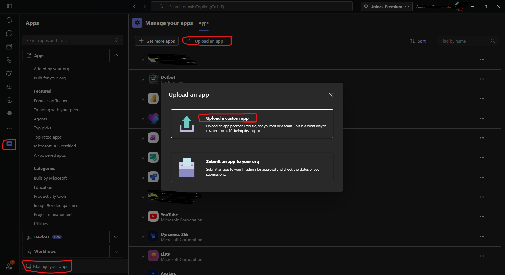
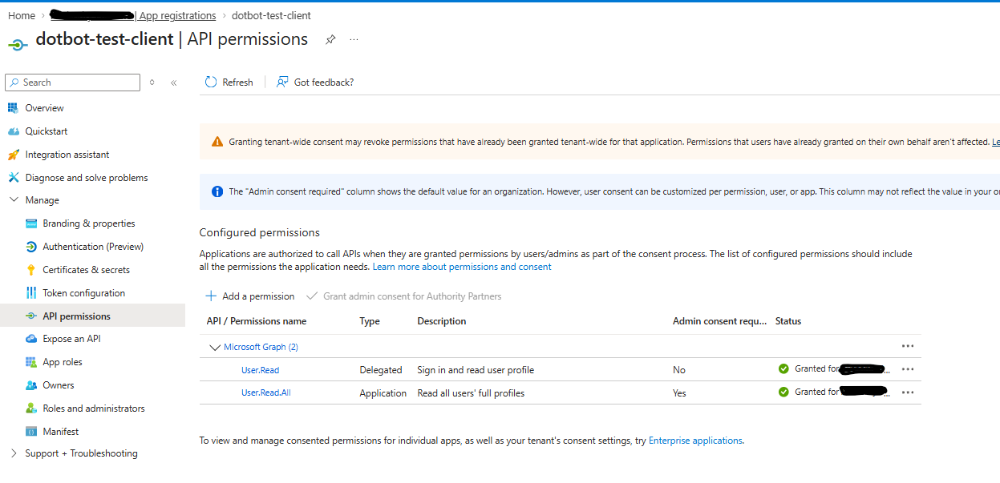

# Teams Proactive Messaging Setup

How Dotbot installs itself for users and sends them question cards via Teams 1:1 chat — and everything that can go wrong.

---

## First-time Setup

End-to-end guide for provisioning a fresh instance from scratch.

### Prerequisites

| Tool | Minimum version | Check |
|------|----------------|-------|
| Azure CLI | any recent | `az --version` |
| Terraform | >= 1.6 | `terraform version` |
| .NET SDK | 9.0 | `dotnet --version` |
| PowerShell | 7+ | `pwsh --version` |

You must be logged in to Azure CLI with an account that has **Owner** or **Contributor + User Access Administrator** on the target subscription, and **Application Administrator** (or Global Administrator) in Entra ID.

```powershell
az login
az account set --subscription "<YOUR_SUBSCRIPTION_ID>"
az account show   # verify
```

### 1. Fill in terraform.tfvars

```powershell
cd server/terraform
Copy-Item terraform.tfvars.example terraform.tfvars
```

Edit `terraform.tfvars`. Required fields:

| Variable | Description | Example |
|----------|-------------|---------|
| `subscription_id` | Azure subscription ID | `"d701a6c9-…"` |
| `api_key` | Shared secret for `/api/notify` and `/api/answers` callers | Any strong random string |

Commonly changed:

| Variable | Default | Notes |
|----------|---------|-------|
| `app_name` | `"dotbot"` | **Must be unique** — used in all resource names: `we-{app_name}-bot-{env}-01` |
| `environment` | `"test"` | Appended to resource names |
| `location` | `"westeurope"` | Azure region |
| `resource_group_name` | `"RG_WE_APPS_DOTBOT_TEST"` | Resource group to create |

By default Terraform creates a new Entra ID app registration (`create_azuread_app = true`). To use an existing app instead:

```hcl
create_azuread_app     = false
microsoft_app_id       = "<YOUR_APP_CLIENT_ID>"
microsoft_app_password = "<YOUR_APP_CLIENT_SECRET>"
```

Leave `teams_catalog_app_id` commented out for now — you'll fill it in after Step 4.

Minimal working example:

```hcl
subscription_id = "xxxxxxxx-xxxx-xxxx-xxxx-xxxxxxxxxxxx"
app_name        = "dotbotmyorg"
environment     = "test"
location        = "northeurope"
api_key         = "change-me-strong-random-secret"
```

### 2. Provision Azure infrastructure

```powershell
cd server/terraform
terraform init
terraform plan
terraform apply
```

Creates: Resource Group, Entra ID App Registration + secret, App Service Plan (B1/Linux), App Service (.NET 9), Azure Bot Service + Teams channel, Storage Account, Key Vault + RSA key, Application Insights + Log Analytics.

Capture the outputs after apply:

```powershell
terraform output -raw azuread_app_id        # Azure AD Client ID
terraform output -raw azuread_app_password  # client secret
terraform output -raw bot_app_service_url   # https://we-{name}-bot-{env}-01.azurewebsites.net
```

### 3. Deploy the .NET server

```powershell
cd server
.\scripts\Deploy.ps1 -ResourceGroup "RG_WE_APPS_DOTBOT_TEST" -AppName "we-dotbotmyorg-bot-test-01"
```

Verify:

```powershell
Invoke-RestMethod "https://we-dotbotmyorg-bot-test-01.azurewebsites.net/api/health"
# → {"status":"ok"}
```

### 4. Publish the Teams app to the org catalog

Generate the manifest (Terraform writes it to `teams-app/manifest.json` — gitignored):

```powershell
cd server/terraform
terraform apply -target=local_file.teams_manifest
```

Build the zip:

```powershell
$dir = "server/teams-app"
Compress-Archive -Path "$dir/manifest.json","$dir/color.png","$dir/outline.png" `
                 -DestinationPath "$dir/dotbot-teams-app.zip" -Force
```

#### Optional: install locally first to test

Before publishing org-wide, you can sideload the app for yourself only:

1. Open **Teams** → click **Apps** in the left sidebar
2. Click **Manage your apps** at the bottom
3. Click **Upload an app** → select `teams-app/dotbot-teams-app.zip`
4. Open the **Dotbot** chat and send any message to verify the bot responds



This lets you confirm the deployment is working without touching the org catalog.

#### Publish org-wide

Then publish:

```powershell
cd server
.\scripts\publish-teams-app.ps1
```

If the script fails due to permissions, publish manually via [Teams Admin Center → Manage apps](https://admin.teams.microsoft.com/policies/manage-apps) → **Upload new app → Upload** → select `teams-app/dotbot-teams-app.zip`.

After publishing, retrieve the catalog-assigned ID (different from the Azure AD Client ID — see [The Three IDs](#the-three-ids-you-must-not-confuse) below):

```powershell
$token    = az account get-access-token --resource https://graph.microsoft.com --query accessToken -o tsv
$clientId = terraform -chdir="server/terraform" output -raw azuread_app_id
$result   = Invoke-RestMethod `
    -Uri "https://graph.microsoft.com/v1.0/appCatalogs/teamsApps?`$filter=externalId eq '$clientId'" `
    -Headers @{ Authorization = "Bearer $token" }
$result.value[0].id   # → teams_catalog_app_id
```

Add it to `terraform.tfvars` and re-apply to push it into App Service settings:

```hcl
teams_catalog_app_id = "xxxxxxxx-xxxx-xxxx-xxxx-xxxxxxxxxxxx"
```

```powershell
cd server/terraform
terraform apply
```

### 5. Grant admin consent for Graph permissions

```powershell
$appId = terraform -chdir="server/terraform" output -raw azuread_app_id
Start-Process "https://portal.azure.com/#blade/Microsoft_AAD_RegisteredApps/ApplicationMenuBlade/CallAnAPI/appId/$appId"
```

In the portal: **API permissions → Grant admin consent for {tenant}**. Required permissions:



| Permission | Purpose |
|-----------|---------|
| `User.Read.All` | Resolve email → AAD Object ID |
| `TeamsAppInstallation.ReadWriteForUser.All` | Proactively install the app for a user |
| `AppCatalog.ReadWrite.All` | Read/update the Teams app catalog entry |
| `Mail.Send` | Email delivery channel (if enabled) |

### 6. Verify end-to-end

```powershell
.\server\scripts\Send-QuestionInstance.ps1 `
    -BotUrl        "https://we-dotbotmyorg-bot-test-01.azurewebsites.net" `
    -ApiKey        "<your api_key>" `
    -RecipientEmail "you@yourdomain.com" `
    -Question      "Is the setup working?" `
    -Choices       @("Yes", "No")
```

The recipient should receive an Adaptive Card in their Teams 1:1 chat.

### 7. Configure Dotbot to use the server

After the server is up, point your local Dotbot instance at it:

1. Start Dotbot (`.bot\go.ps1`)
2. Open the dashboard → **Settings**
3. Click **Mothership**
4. Set **Server URL** to your App Service URL (e.g. `https://we-dotbotmyorg-bot-test-01.azurewebsites.net`)
5. Set **API Key** to the `api_key` value from `terraform.tfvars`
6. Click **Test Connection** — should return green
7. Set **Recipients** to the Teams users who should receive question cards (email addresses)

Then run a workflow. Configured recipients will receive Adaptive Cards in their Teams 1:1 chat.

---

## The Three IDs You Must Not Confuse

Proactive Teams delivery involves three distinct identifiers that look similar but serve completely different purposes:

| What | Where it lives | Example |
|------|---------------|---------|
| **Azure AD Client ID** | Entra ID app registration (`azuread-app.tf`) | A GUID like `97b86de5-…` |
| **Teams Catalog App ID** | Assigned by the Teams org-wide app catalog when you publish | A different GUID like `cfa7e7da-…` |
| **Manifest ID** | `teams-app/manifest.json` → `id` field | Must equal the Azure AD Client ID |

The **Azure AD Client ID** and the **Manifest ID** are always the same value. The **Teams Catalog App ID** is assigned by Teams when the app is published to the org catalog — it is _not_ the same as the client ID, even though both are GUIDs.

### Where each ID is used

- `TokenValidation:Audiences:0` → Azure AD Client ID (bot identity)
- `Teams:TeamsAppId` → Teams Catalog App ID (for Graph API `appCatalogs/teamsApps/{id}`)
- `manifest.json` → `id` and `botId` both use the Azure AD Client ID

If `Teams:TeamsAppId` is set to the Azure AD Client ID instead of the catalog ID, the proactive install will fail with:
```
NotFound: The definition for app '<client-id>' was not found in the org-wide catalog.
```

The catalog ID is set via the `teams_catalog_app_id` Terraform variable in `variables.tf`. To look up the catalog ID for an existing app:

```powershell
# Using an app token with AppCatalog.ReadWrite.All:
GET https://graph.microsoft.com/v1.0/appCatalogs/teamsApps?$filter=externalId eq '<azure-ad-client-id>'
# Response → value[0].id is the catalog ID
```

## Graph API Permissions

Terraform (`azuread-app.tf`) manages all Graph permissions as application roles with admin consent. The GUIDs must exactly match the Microsoft Graph service principal's `appRoles` — there is no validation at plan time if you use the wrong GUID.

### Required permissions

| Permission | GUID | Purpose |
|-----------|------|---------|
| `User.Read.All` | `df021288-bdef-4463-88db-98f22de89214` | Resolve email → AAD Object ID |
| `Mail.Send` | `b633e1c5-b582-4048-a93e-9f11b44c7e96` | Email delivery channel |
| `TeamsAppInstallation.ReadWriteForUser.All` | `74ef0291-ca83-4d02-8c7e-d2391e6a444f` | Proactively install the Teams app for a user |
| `AppCatalog.ReadWrite.All` | `dc149144-f292-421e-b185-5953f2e98d7f` | Read/update the Teams app catalog entry |

### How to verify the right GUIDs

Permission GUIDs are tenant-specific to the Microsoft Graph service principal. To look up the correct GUID for a permission name:

```powershell
$token = az account get-access-token --resource https://graph.microsoft.com --query accessToken -o tsv
$headers = @{ Authorization = "Bearer $token" }
$sp = Invoke-RestMethod -Uri "https://graph.microsoft.com/v1.0/servicePrincipals?`$filter=appId eq '00000003-0000-0000-c000-000000000000'&`$select=appRoles" -Headers $headers
$sp.value[0].appRoles | Where-Object { $_.value -eq 'TeamsAppInstallation.ReadWriteForUser.All' } | Select-Object id, value
```

### How to verify what the app token actually contains

```powershell
# Get a fresh client credentials token, then decode the JWT:
$jwt = $tokenResp.access_token
$payload = $jwt.Split('.')[1]
# Pad and decode base64
$padded = $payload + ('=' * (4 - $payload.Length % 4))
$decoded = [System.Text.Encoding]::UTF8.GetString([Convert]::FromBase64String($padded))
$decoded | ConvertFrom-Json | Select-Object -ExpandProperty roles
```

If the roles don't include the permission you expect, the GUID in Terraform is wrong.

## Proactive Delivery Flow

`TeamsDeliveryProvider.DeliverAsync()` in `Services/Delivery/TeamsDeliveryProvider.cs`:

1. **Resolve user**: `UserResolverService` calls Graph `GET /users/{email}` → gets AAD Object ID
2. **Check conversation cache**: looks up `ConversationReferenceStore` for an existing 1:1 chat reference
3. **If no reference → proactive install** (`ProactiveInstallAndCreateConversationAsync`):
   - **Step 1**: Graph API `POST /users/{userId}/teamwork/installedApps` with `teamsApp@odata.bind` pointing to the **catalog app ID**
   - **Step 2**: Bot Framework `CreateConversationAsync` to open a 1:1 chat and store the conversation reference
4. **Send card**: `ContinueConversationAsync` sends the Adaptive Card into the 1:1 chat

### CreateConversationAsync parameters

```csharp
await channelAdapter.CreateConversationAsync(
    botAppId,                              // Bot's Azure AD Client ID
    "msteams",                             // Channel
    serviceUrl,                            // e.g. "https://smba.trafficmanager.net/emea/"
    "https://api.botframework.com",        // Audience — MUST be a valid URI
    parameters,                            // ConversationParameters with tenant, members
    callback,                              // Stores the conversation reference
    ct);
```

The `audience` parameter (4th arg) **must be a valid URI**. The M365 Agents SDK's MSAL module passes it to `new Uri(...)` internally. If you pass a bare GUID (like the bot app ID), it will throw:
```
System.UriFormatException: Invalid URI: The format of the URI could not be determined.
```

Use `"https://api.botframework.com"` for the audience.

## Teams App Catalog

The Teams app must be published to the tenant's org-wide catalog before proactive install can work. Terraform generates the manifest at `teams-app/manifest.json` but does **not** publish it to the catalog. The generated manifest is gitignored (it contains real Azure AD values); only the icon files (`color.png`, `outline.png`) are tracked in `teams-app/`. Run `terraform apply` to produce the manifest before packaging.

### First-time publish

Build the zip and upload via Teams Admin Center:

```powershell
$manifest = "teams-app/manifest.json"
$color    = "teams-app/color.png"
$outline  = "teams-app/outline.png"
$zip      = "teams-app/dotbot-teams-app.zip"
Compress-Archive -Path $manifest, $color, $outline -DestinationPath $zip -Force
```

Then upload at: https://admin.teams.microsoft.com → Manage apps → Upload new app

After publishing, query the catalog ID and update `teams_catalog_app_id` in `terraform/variables.tf`.

### Updating the catalog entry

If the manifest changes (new version, updated valid domains, etc.), the catalog entry needs updating. The app has `AppCatalog.ReadWrite.All`, so you can update it programmatically using the app's own client credentials token:

```
POST https://graph.microsoft.com/v1.0/appCatalogs/teamsApps/{catalogId}/appDefinitions
Content-Type: application/zip
Body: <zip bytes>
```

## Configuration Reference

All config is set via App Service app settings, managed by Terraform in `main.tf`:

| Setting | Source | Notes |
|---------|--------|-------|
| `Teams__TeamsAppId` | `var.teams_catalog_app_id` | Catalog-assigned ID, not the client ID |
| `Teams__ServiceUrl` | `var.teams_service_url` | Region-specific Bot Framework service URL |
| `TokenValidation__Audiences__0` | `local.bot_app_id` | Azure AD Client ID |
| `TokenValidation__TenantId` | `local.tenant_id` | From `azurerm_client_config` |
| `Connections__ServiceConnection__*` | Various | MSAL client credentials for Bot Framework auth |

## Troubleshooting

### Delivery shows `status: "failed"`

Check App Insights traces for the instance timeframe:

```kql
traces
| where timestamp > ago(10m)
| where message contains "<instanceId>" or message contains "fail" or message contains "error"
| project timestamp, message, severityLevel
| order by timestamp asc
```

Also check exceptions:

```kql
exceptions
| where timestamp > ago(10m)
| project timestamp, type, outerMessage, innermostMessage
| order by timestamp asc
```

### Common errors and fixes

**`Forbidden` on Teams app install**
→ The app token lacks `TeamsAppInstallation.ReadWriteForUser.All`. Check the permission GUID in `azuread-app.tf` matches the real GUID (see "How to verify the right GUIDs" above).

**`NotFound: The definition for app '...' was not found in the org-wide catalog`**
→ `Teams:TeamsAppId` is set to the Azure AD Client ID instead of the catalog-assigned ID. Or the app hasn't been published to the catalog yet.

**`UriFormatException: Invalid URI`**
→ The `audience` parameter in `CreateConversationAsync` is a bare GUID instead of `https://api.botframework.com`.

**`Request_ResourceNotFound` on user lookup**
→ The email address doesn't exist in the tenant. This is a caller-side data issue — verify the recipient email is correct.

## Deploying

```powershell
# App-only deploy (no infra changes):
.\scripts\Deploy.ps1 -AutoApprove

# Full deploy including Terraform:
.\scripts\Deploy.ps1 -WithTerraform -AutoApprove
```

After a `-WithTerraform` deploy, the app secret is rotated automatically (it uses `timestamp()` in `rotate_when_changed`). The new secret is applied to the App Service settings in the same Terraform apply.
