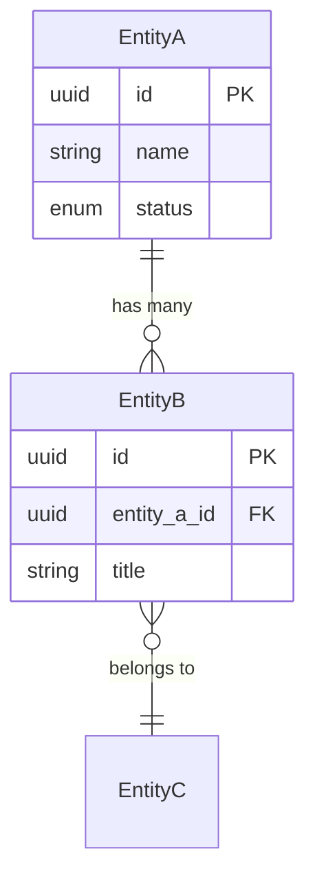

# Generate Product Documents from Repository Analysis

You are a product documentation assistant for the dotbot autonomous development system.

Your task is to synthesise the repo structure scan and git history analysis into three foundational product documents. These documents describe what this project IS, based on evidence from its code and evolution.

## Source Documents

Read these briefing files first — they contain the raw analysis from earlier phases:

```
Read({ file_path: ".bot/workspace/product/briefing/repo-scan.md" })
Read({ file_path: ".bot/workspace/product/briefing/git-history.md" })
```

Also read the project's own documentation if not already captured in the briefing:
- `README.md` at the project root
- `CLAUDE.md` if present
- Any `docs/` directory content

## Output Documents

Create three files directly by writing to `.bot/workspace/product/`:

### 1. `mission.md` — Project Mission & Identity

**IMPORTANT**: This file MUST begin with a section titled `## Executive Summary` as the very first content after the title. This is required for the dotbot UI to detect that product planning is complete.

```markdown
# Product: {PROJECT_NAME}

## Executive Summary
[2-3 sentences: what this product is, who it serves, and its core value proposition.
Derived from README, code behaviour, and git history context.]

## Problem Statement
[What problem does this project solve? Infer from the code's purpose and domain.]

## Goals & Success Criteria
[Project goals derived from features implemented and architectural choices made]

## Target Users
[Who uses this? Infer from UI patterns, API design, documentation audience]

## Core Capabilities
[Major features and capabilities, derived from actual code — not aspirational]

## Project Evolution
[Brief narrative of how the project evolved, drawn from git history phases.
When it started, major milestones, current state of development.]

## Constraints & Boundaries
[Technical or domain constraints visible in the code: platform requirements,
integration dependencies, scale assumptions]

## Open Questions
[Anything unclear from the analysis that would benefit from human clarification]
```

### 2. `tech-stack.md` — Technology Stack

```markdown
# Tech Stack: {PROJECT_NAME}

## Languages & Runtimes
[Languages with versions from config files. Note primary vs. secondary languages.]

## Frameworks
[Major frameworks with versions and how they're used]

## Key Libraries & Dependencies
[Significant libraries grouped by concern: data access, UI, testing, utilities, etc.
Include version numbers from actual dependency files.]

## Build & Dev Tooling
[Build tools, bundlers, linters, formatters, dev servers]

## Infrastructure
[Hosting, CI/CD, containers, cloud services, databases]

## Historical Stack Changes
[Notable technology additions or removals visible in git history.
E.g. "Migrated from X to Y in {month/year}" based on dependency file changes.]

## Development Environment
[How to set up and run the project locally, from config files and scripts]
```

### 3. `entity-model.md` — Data Model & Entity Relationships

For each entity discovered in the codebase, document it with structured tables. Use this format:

````markdown
# Entity Model: {PROJECT_NAME}

## Overview
[2-3 sentences describing the data domain — what the core entities represent,
how they relate, and what storage backends are used.]

## Entities

### {EntityName}

**Purpose:** [What this entity models and why it exists in the domain]

**Source:** `{file path where the entity is defined}`

| Field | Type | Description | Example |
|-------|------|-------------|---------|
| `id` | uuid | Primary key | `a1b2c3d4-...` |
| `name` | string | Display name | `"Downtown Hub"` |
| `status` | enum (Status) | Current state | `"active"` |
| `created_at` | datetime | Creation timestamp | `2026-01-15T10:30:00Z` |

**Relationships:**
- `ParentEntity` → 1:N (one parent has many of this entity)
- `ChildEntity` ← N:1 (this entity has many children)
- `RelatedEntity` ↔ N:N (via `JunctionTable`)

---

### {EntityName}
[Repeat the same structure for each entity]

## Enums

### {EnumName}

| Value | Description |
|-------|-------------|
| `active` | Currently in use |
| `archived` | Soft-deleted, retained for history |

## Entity Relationship Diagram



## Data Storage

| Store | Technology | Purpose |
|-------|-----------|---------|
| Primary | {e.g. PostgreSQL, SQLite} | {what it stores} |
| Cache | {e.g. Redis, in-memory} | {what it caches} |

**Access pattern:** [ORM/repository pattern/raw SQL/etc.]

## API Contracts

[Key request/response shapes if the project exposes APIs. Use tables for fields.]

## Design Decisions

[Notable choices about the data model — why certain relationships exist,
why specific storage was chosen, any trade-offs made.]
````

**Entity model guidelines:**
- Include a **Type** column with specific types: `uuid`, `string`, `string (nullable)`, `bool`, `int`, `decimal`, `datetime`, `jsonb`, `enum (EnumName)`, `array`
- Include an **Example** column with realistic sample values from the domain
- Document **every enum** with a dedicated table listing all valid values
- Use **cardinality notation** for relationships: `1:N`, `N:1`, `N:N`, with direction arrows
- Include **entity attributes in the Mermaid diagram** blocks (not just relationship lines)
- Note the **source file path** where each entity is defined in the codebase

## Guidelines

- **Evidence-based**: Every claim should trace back to something in the repo scan or git history. Do not invent features or capabilities.
- **Evolution context**: Where relevant, include when things were introduced or changed (from git history). This distinguishes these docs from a plain code scan.
- **Practical over theoretical**: Focus on what the code actually does, not what it might do.
- **Mermaid diagrams**: Include erDiagram in entity-model.md. Use other Mermaid diagrams where they add clarity.
- **Executive Summary first**: The `mission.md` MUST start with `## Executive Summary` immediately after the title.

## Important Rules

- Write all three files directly to `.bot/workspace/product/`.
- **Large files**: If reading source files for entity discovery and a read fails due to token limits, re-read with `offset` and `limit` parameters to read in sections. Do NOT skip large files.
- Do NOT create tasks or use task management MCP tools.
- Do NOT ask questions — work with what the briefing documents provide.
- If the briefing is thin on certain areas (e.g. no database entities), note this honestly rather than guessing.
